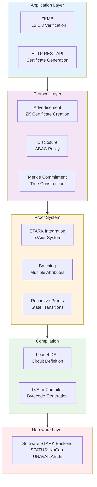

# ZKIP-STARK

[](https://github.com/memmmmike/zkip-stark/actions)
[](LICENSE)
[](https://leanprover.github.io/lean4/)

Zero-Knowledge Intellectual Property Protocol with STARK Proofs

> ## ⚠️ Status: Early prototype — NOT usable, NOT secure, NOT a ZK system
>
> This repository is an **architectural skeleton**. The type definitions, module
> layout, and API surface sketch a plausible protocol, but **none of the
> cryptography is implemented**. Do not deploy this, do not build on it, and do
> not treat any output it produces as a proof or an attestation.
>
> Specifically, as of this commit:
>
> - **Every circuit is a stub.** All nine circuit bodies return a constant or
>   echo an input. No predicate, Merkle path, hash, or FRI check is expressed as
>   a constraint. See [`REMEDIATION.md`](REMEDIATION.md) for the table.
> - **There is no zero-knowledge.** The secret witness is copied into the public
>   claim, so any "certificate" publishes the value it purports to hide.
> - **There is no hashing.** `Hash.hash` is the identity function, so the
>   "Merkle root" is the concatenation of the plaintext leaves.
> - **There is no formal verification.** The repository contains zero `theorem`
>   or `lemma` declarations. "Verified" here means only that Lean's type checker
>   accepts the code and that two recursive functions have `termination_by`.
> - **Most modules do not compile.** Seven modules and six test targets are
>   excluded from the default build target and have type errors.
> - **The published benchmarks are not real.** They time functions that return
>   literals.
>
> [`REMEDIATION.md`](REMEDIATION.md) tracks what would have to be built to make
> the claims above true. Until those items are closed, this README describes an
> intended design, not a delivered one.

## Overview

ZKIP-STARK is an *in-progress design* for verifiable disclosure of intellectual
property attributes without revealing sensitive data. The intent is to use
Merkle tree commitments and STARK proofs to bind advertised claims to committed
data, preventing an "Ad-Switch Attack" in which a malicious party advertises
different metrics than those committed.

That binding is **not currently implemented**; see the status notice above.

## Intended Features

Everything in this list is a design goal. The "Status" column reflects what is
actually in the tree today.

| Feature | Intent | Status |
|---|---|---|
| STARK Proofs | Ix/Aiur integration for transparent arguments of knowledge | Wired up, but proves a trivial statement |
| Predicate circuits | Prove `attribute ≥ threshold` without revealing the attribute | ❌ Not implemented — circuit returns the attribute |
| Merkle commitment | Bind claims to committed data | ❌ Not implemented — hash is identity |
| Zero-knowledge | Keep the witness private | ❌ Broken — witness is published in the claim |
| Formal verification | Machine-checked soundness proofs in Lean 4 | ❌ Not started — no theorems exist |
| Recursive proofs | Constant-size proofs over unbounded state transitions | ❌ Not implemented — verifier circuit returns `1` |
| Batching | Multiple attribute checks in a single proof | ❌ Not implemented — circuit returns first attribute |
| Hardware acceleration | NoCap offload for Poseidon | ❌ Unavailable — FFI both branches call the same software stub |
| ZKMB application | TLS 1.3 compliance verification | ❌ Does not compile |

## Architecture

The platform is *intended* to rest on two pillars. Neither is load-bearing yet:

- **Soundness**: machine-checked correctness in Lean 4. Not started — the
  repository contains no theorems. Lean currently provides type checking only.
- **Speed**: STARK proofs (Ix/Aiur) for scalable transparent arguments.
  Software-only proving; NoCap hardware unavailable. No meaningful benchmark
  exists, because the circuits do no work.



### Core Components

- `STARKIntegration.lean` - Core STARK proof generation and verification
- `Batching.lean` - Multiple attribute checks in single proof
- `RecursiveProofs.lean` - Verifier circuit for proof composition
- `FullRecursiveVerification.lean` - Complete Zk-VM environment
- `HashConstraints.lean` - Poseidon/Merkle hash as circuit constraints
- `FRIVerification.lean` - FRI protocol as circuit constraints
- `MerkleReconstruction.lean` - Full tree verification as constraints
- `ZKMB.lean` - Zero-Knowledge Middlebox application
- `Performance.lean` - Performance profiling and metrics
- `NoCapFFI.lean` - Hardware acceleration bindings

## Requirements

- Lean 4 (v4.24.0 or later)
- Elan (Lean version manager)
- Lake (Lean build system, included with Lean)
- Ix/Aiur STARK system (automatically fetched via Lake)

## Installation

1. Clone the repository:
```bash
git clone https://github.com/yourusername/zkip-stark.git
cd zkip-stark
```

2. Build the project:
```bash
lake build
```

3. Run tests:
```bash
lake build Tests
```

## Quick Start

### Generate a ZK Certificate

```lean
import ZkIpProtocol

-- Create an IP metadata object (Ixon)
let ixon : Ixon := {
  id := 1
  attributes := #[IPAttribute.performance 1000, IPAttribute.security 5]
  merkleRoot := <computed-merkle-root>
  timestamp := <current-timestamp>
}

-- Define a predicate to verify
let predicate : IPPredicate := {
  threshold := 500
  operator := ">="
}

-- Generate certificate with STARK proof
let cert ← generateCertificateWithSTARK ixon predicate privateAttribute ipData attributeIndex
```

### Verify a Certificate

```lean
let isValid ← verifyCertificate cert
if isValid then
  IO.println "Certificate verified successfully"
else
  IO.println "Certificate verification failed"
```

## Project Structure

```
zkip-stark/
├── ZkIpProtocol/          # Core protocol modules
│   ├── CoreTypes.lean     # Shared data structures
│   ├── STARKIntegration.lean  # STARK proof integration
│   ├── MerkleCommitment.lean   # Merkle tree operations
│   ├── Advertisement.lean     # Certificate generation
│   ├── Batching.lean          # Batch proof support
│   ├── RecursiveProofs.lean   # Recursive verification
│   └── ZKMB.lean              # Zero-Knowledge Middlebox
├── Tests/                 # Test suites
│   ├── ProtocolTests.lean
│   ├── STARKTests.lean
│   └── Validation/        # Comprehensive validation tests
└── lakefile.lean          # Build configuration
```

## Technical Details

### Security Properties

**None of the following hold today.** They are the properties the design aims
for, listed so that the gap is explicit:

- **Ad-Switch Attack Resistance** — *not achieved*. `verifySTARKProof`
  historically ignored the caller's public inputs and rebuilt the claim from the
  proof itself, so the verifier never checked the root it was handed. The
  corresponding test could not fail.
- **Merkle Root Binding** — *not achieved*. `Hash.hash` on `ByteArray` is the
  identity function, so the commitment is the plaintext and binds nothing.
- **Zero-knowledge** — *not achieved*. `AiurSystem.prove` places every argument
  into the public claim; the "private" input is published.
- **Termination Guarantees** — *partially true, and much weaker than it sounds*.
  Two recursive functions carry `termination_by`. The absence of `sorry` is
  vacuous here: there are no proofs to leave incomplete.

### Performance

No trustworthy performance figures exist for this repository, and previously
published ones have been withdrawn.

The former claims — sub-3ms verification, 300–500 proofs/second, and a constant
~162 KB proof across 1,000 recursive transitions — were produced by benchmarks
that time stub functions. `testSingleProofLatency`, for example, measures
`ZKMB.verifyPacket`, whose body is `true`. Numbers will be republished only once
the circuits perform real work and the benchmark suite compiles and runs in CI.

- **Hardware Acceleration**: unavailable. `HardwareCtx.create` always returns
  `none`, and both branches of `poseidonHashFFI` call the same software stub.

### Intended Optimization Techniques

Design notes for work not yet done. None of these are implemented as circuit
constraints:

- **Batching**: multiple attribute checks in a single STARK proof
- **Recursive Proofs**: constant proof size via verifier circuits
- **String Matching**: ASCII character packing (2 constraints per character)
- **Boolean Logic**: non-zero = True for efficient OR-gates

## Testing

**The validation suite does not currently compile or run.** Six of the eleven
test targets construct `MerkleProof` with a `leafIndex` field that does not
exist on the structure, and `ZKMBLatencyTests` contains unreachable code after a
`match`. CI previously hid this by building only one test target with
`continue-on-error: true`.

```bash
lake build Tests.Validation.MasterValidation   # currently fails
```

Intended test suites, and what they would need to become meaningful:

| Suite | Status | Blocker |
|---|---|---|
| Soundness tests | Does not compile | `leafIndex` field; also vacuous until the verifier checks caller-supplied inputs |
| STARK round-trip | Does not compile | `leafIndex` field |
| Throughput benchmarks | Does not compile | `leafIndex` field; measures stubs |
| ZKMB latency | Does not compile | Unreachable code; `ZKMB.lean` itself does not compile |
| Recursive stability | Compiles, but vacuous | Recursive verifier circuit returns `1` |

## Dependencies

- **Ix/Aiur**: STARK proof system (https://github.com/argumentcomputer/ix)
- **Lean 4**: Formal verification framework
- **NoCap**: Hardware acceleration interface (STATUS: UNAVAILABLE - hardware not integrated)

## Documentation

For detailed documentation, see:
- Architecture overview in `ZkIpProtocol/`
- Integration guide for STARK proofs
- Performance profiling in `ZkIpProtocol/Performance.lean`

## Contributing

Contributions are welcome! Please ensure:
- All code compiles without errors (`lake build`)
- No `sorry` symbols in proofs
- Tests pass (`lake build Tests`)
- Code follows Lean 4 style guidelines

## License

Licensed under the Apache License, Version 2.0. See [LICENSE](LICENSE) for details.

## Status

**Early prototype — not usable.** See the notice at the top of this file and the
tracked work in [`REMEDIATION.md`](REMEDIATION.md).

This is a research skeleton exploring how a selective-disclosure protocol might
be structured in Lean 4. It is not a product, it has not been audited, and no
part of it should be relied upon for security.

## References

- Ix/Aiur STARK System: https://github.com/argumentcomputer/ix
- Zero-Knowledge Middlebox: https://www.usenix.org/system/files/sec22-grubbs.pdf
- NoCap Hardware Acceleration: https://people.csail.mit.edu/devadas/pubs/micro24_nocap.pdf
