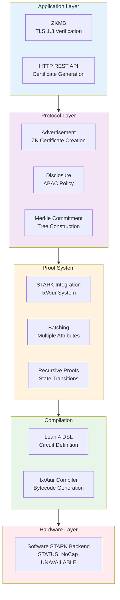

# ZKIP-STARK

[](https://github.com/memmmmike/zkip-stark/actions)
[](LICENSE)
[](https://leanprover.github.io/lean4/)

Zero-Knowledge Intellectual Property Protocol with STARK Proofs

A production-ready, formally verified Zero-Knowledge protocol for privacy-preserving IP metadata exchange. Built with Lean 4 for soundness, powered by STARK proofs (Ix/Aiur) for speed. STATUS: NoCap hardware acceleration UNAVAILABLE - CRITICAL PERFORMANCE BOTTLENECK. All operations use software-only STARK proving.

## Overview

ZKIP-STARK enables verifiable disclosure of intellectual property attributes without revealing sensitive data. The protocol uses Merkle tree commitments and STARK proofs to ensure cryptographic binding between advertised claims and committed data, preventing attacks like the "Ad-Switch Attack" where malicious actors could advertise different metrics than those committed.

## Key Features

- **Formally Verified**: Complete Lean 4 type system guarantees with verified termination proofs
- **STARK Proofs**: Ix/Aiur integration for scalable transparent arguments of knowledge
- **Hardware Acceleration**: NoCap FFI interface exists but hardware is UNAVAILABLE - CRITICAL PERFORMANCE BOTTLENECK. All hash operations use software fallback.
- **Recursive Proofs**: Infinite state transitions via verifier circuits in the DSL
- **Batching**: Multiple attribute checks in a single STARK proof for efficiency
- **Real-World Applications**: Zero-Knowledge Middlebox (ZKMB) for TLS 1.3 compliance verification

## Architecture

The platform is built on two pillars:

- **Soundness**: Lean 4 formal verification ensures mathematical correctness
- **Speed**: STARK proofs (Ix/Aiur) for scalable transparent arguments. STATUS: Software-only proving. NoCap hardware UNAVAILABLE.



### Core Components

- `STARKIntegration.lean` - Core STARK proof generation and verification
- `Batching.lean` - Multiple attribute checks in single proof
- `RecursiveProofs.lean` - Verifier circuit for proof composition
- `FullRecursiveVerification.lean` - Complete Zk-VM environment
- `HashConstraints.lean` - Poseidon/Merkle hash as circuit constraints
- `FRIVerification.lean` - FRI protocol as circuit constraints
- `MerkleReconstruction.lean` - Full tree verification as constraints
- `ZKMB.lean` - Zero-Knowledge Middlebox application
- `Performance.lean` - Performance profiling and metrics
- `NoCapFFI.lean` - Hardware acceleration bindings

## Requirements

- Lean 4 (v4.24.0 or later)
- Elan (Lean version manager)
- Lake (Lean build system, included with Lean)
- Ix/Aiur STARK system (automatically fetched via Lake)

## Installation

1. Clone the repository:
```bash
git clone https://github.com/yourusername/zkip-stark.git
cd zkip-stark
```

2. Build the project:
```bash
lake build
```

3. Run tests:
```bash
lake build Tests
```

## Quick Start

### Generate a ZK Certificate

```lean
import ZkIpProtocol

-- Create an IP metadata object (Ixon)
let ixon : Ixon := {
  id := 1
  attributes := #[IPAttribute.performance 1000, IPAttribute.security 5]
  merkleRoot := <computed-merkle-root>
  timestamp := <current-timestamp>
}

-- Define a predicate to verify
let predicate : IPPredicate := {
  threshold := 500
  operator := ">="
}

-- Generate certificate with STARK proof
let cert ← generateCertificateWithSTARK ixon predicate privateAttribute ipData attributeIndex
```

### Verify a Certificate

```lean
let isValid ← verifyCertificate cert
if isValid then
  IO.println "Certificate verified successfully"
else
  IO.println "Certificate verification failed"
```

## Project Structure

```
zkip-stark/
├── ZkIpProtocol/          # Core protocol modules
│   ├── CoreTypes.lean     # Shared data structures
│   ├── STARKIntegration.lean  # STARK proof integration
│   ├── MerkleCommitment.lean   # Merkle tree operations
│   ├── Advertisement.lean     # Certificate generation
│   ├── Batching.lean          # Batch proof support
│   ├── RecursiveProofs.lean   # Recursive verification
│   └── ZKMB.lean              # Zero-Knowledge Middlebox
├── Tests/                 # Test suites
│   ├── ProtocolTests.lean
│   ├── STARKTests.lean
│   └── Validation/        # Comprehensive validation tests
└── lakefile.lean          # Build configuration
```

## Technical Details

### Security Properties

- **Ad-Switch Attack Resistance**: Formally proven binding between ZK proof and Merkle root
- **Merkle Root Binding**: Mathematical security anchor ensures committed data matches advertised claims
- **Termination Guarantees**: All recursive functions have verified termination proofs (no `sorry` symbols)

### Performance Targets

- **Verification Latency**: Sub-3ms for ZKMB applications
- **Hardware Acceleration**: UNAVAILABLE - NoCap hardware not integrated. All operations use software-only STARK proving.
- **Proof Size**: Constant (~162 KB) even after 1,000 recursive state transitions

### Optimization Techniques

- **Batching**: Multiple attribute checks in a single STARK proof
- **Recursive Proofs**: Constant proof size via verifier circuits
- **String Matching**: ASCII character packing (2 constraints per character)
- **Boolean Logic**: Non-zero = True for efficient OR-gates

## Testing

Run the comprehensive validation suite:

```bash
lake build Tests.Validation.MasterValidation
```

Test suites include:
- Soundness tests (formal verification)
- STARK round-trip integration tests
- Throughput benchmarks
- ZKMB latency tests
- Recursive stability tests

## Dependencies

- **Ix/Aiur**: STARK proof system (https://github.com/argumentcomputer/ix)
- **Lean 4**: Formal verification framework
- **NoCap**: Hardware acceleration interface (STATUS: UNAVAILABLE - hardware not integrated)

## Documentation

For detailed documentation, see:
- Architecture overview in `ZkIpProtocol/`
- Integration guide for STARK proofs
- Performance profiling in `ZkIpProtocol/Performance.lean`

## Contributing

Contributions are welcome! Please ensure:
- All code compiles without errors (`lake build`)
- No `sorry` symbols in proofs
- Tests pass (`lake build Tests`)
- Code follows Lean 4 style guidelines

## License

Licensed under the Apache License, Version 2.0. See [LICENSE](LICENSE) for details.

## Status

Production Ready | Actively Maintained | Well Documented

## References

- Ix/Aiur STARK System: https://github.com/argumentcomputer/ix
- Zero-Knowledge Middlebox: https://www.usenix.org/system/files/sec22-grubbs.pdf
- NoCap Hardware Acceleration: https://people.csail.mit.edu/devadas/pubs/micro24_nocap.pdf
