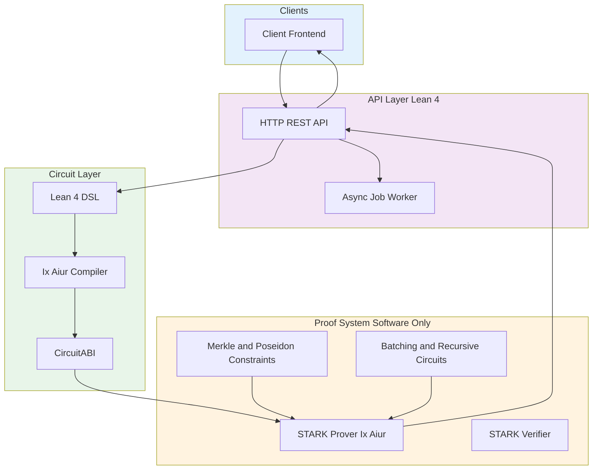

# CHAP - Commercial High Assurance Platform

[](https://github.com/memmmmike/zkip-stark/actions)
[](LICENSE)
[](https://leanprover.github.io/lean4/)

## ⚠️ Prototype Status

**What actually works:**
- STARK proof generation/verification (Ix/Aiur integration)
- Basic circuit compilation (Lean 4 → Aiur bytecode)
- REST API for certificate generation/verification
- Lean 4 type-checking (no `sorry` symbols)

**Everything else is placeholder code that returns constants.** This includes:
- Merkle path verification (returns `true`)
- FRI verification (returns `1`)
- Recursive proof verification (returns `1`)
- Encryption/disclosure features

---

**CHAP** (Commercial High Assurance Platform) is a zero-knowledge platform prototype for high-assurance commercial transactions. Built on STARK proofs (Ix/Aiur) with Lean 4 type-checking.

## Overview

ZKIP-STARK enables verifiable disclosure of intellectual property attributes without revealing sensitive data. The protocol uses Merkle tree commitments and STARK proofs to ensure cryptographic binding between advertised claims and committed data, preventing attacks like the "Ad-Switch Attack" where malicious actors could advertise different metrics than those committed.

## Key Features

- **Type-Checked**: Lean 4 type system with verified termination proofs (no `sorry`)
- **STARK Proofs**: Ix/Aiur integration for transparent arguments of knowledge
- **No Trusted Setup**: STARKs are transparent - no ceremony, no "toxic waste"
- **Post-Quantum Secure**: Hash-based proofs remain secure against quantum computers

**Not Yet Implemented** (placeholder code):
- Recursive proofs (returns constant)
- Merkle path verification (returns constant)

## Why STARKs (Not SNARKs)

For regulated financial applications, we chose **STARKs** over SNARKs:

| Property | STARKs (Our Choice) | SNARKs (Groth16, etc.) |
|----------|---------------------|------------------------|
| Trusted Setup | **None required** | Required ceremony |
| Quantum Security | **Post-quantum safe** | Vulnerable |
| Auditability | **Trust only hash functions** | Trust ceremony participants |
| Proof Size | ~162 KB | ~200 bytes |

**The trusted setup problem**: Many SNARKs require participants to generate parameters and destroy "toxic waste." If anyone keeps their secret, they can forge proofs. For regulated finance, you cannot tell auditors "trust that these people deleted their keys."

See [docs/architecture.md](docs/architecture.md) for detailed rationale.

## Architecture

The platform is built on two pillars:

- **Type Safety**: Lean 4 type-checking prevents malformed circuits (no `sorry` symbols)
- **Transparency**: STARK proofs (Ix/Aiur) require no trusted setup. Software-only proving (NoCap unavailable).



### Core Components

- `STARKIntegration.lean` - Core STARK proof generation and verification
- `Batching.lean` - Multiple attribute checks in single proof
- `RecursiveProofs.lean` - Verifier circuit for proof composition
- `FullRecursiveVerification.lean` - Complete Zk-VM environment
- `HashConstraints.lean` - Poseidon/Merkle hash as circuit constraints
- `FRIVerification.lean` - FRI protocol as circuit constraints
- `MerkleReconstruction.lean` - Full tree verification as constraints
- `Performance.lean` - Performance profiling and metrics
- `NoCapFFI.lean` - Hardware acceleration bindings

## Hashing Policy

- **In-circuit hashing**: Poseidon over the Goldilocks field (see `HashConstraints.lean`).
- **Off-chain commitments**: Blake3 (see `buildMerkleTreeBlake3` in `MerkleCommitment.lean`). These roots are not circuit-compatible.

## Requirements

- Lean 4 (v4.24.0 or later)
- Elan (Lean version manager)
- Lake (Lean build system, included with Lean)
- Ix/Aiur STARK system (automatically fetched via Lake)

## Installation

1. Clone the repository:
```bash
git clone https://github.com/yourusername/zkip-stark.git
cd zkip-stark
```

2. Build the project:
```bash
lake build
```

3. Run tests:
```bash
lake build Tests
```

## Quick Start

### Proof Generation (Software-Only)

Proof generation is software-only in the current codebase. It can be memory-intensive on constrained hosts.

### Generate a ZK Certificate

```lean
import ZkIpProtocol

-- Create an IP metadata object (Ixon)
let ixon : Ixon := {
  id := 1
  attributes := #[IPAttribute.performance 1000, IPAttribute.security 5]
  merkleRoot := <computed-merkle-root>
  timestamp := <current-timestamp>
}

-- Define a predicate to verify
let predicate : IPPredicate := {
  threshold := 500
  operator := ">="
}

-- Generate certificate with STARK proof
let cert ← generateCertificateWithSTARK ixon predicate privateAttribute ipData attributeIndex
```

### Verify a Certificate

```lean
let isValid ← verifyCertificate cert
if isValid then
  IO.println "Certificate verified successfully"
else
  IO.println "Certificate verification failed"
```

## Project Structure

```
zkip-stark/
├── ZkIpProtocol/          # Core protocol modules
│   ├── CoreTypes.lean     # Shared data structures
│   ├── STARKIntegration.lean  # STARK proof integration
│   ├── MerkleCommitment.lean   # Merkle tree operations
│   ├── Advertisement.lean     # Certificate generation
│   ├── Batching.lean          # Batch proof support
│   ├── RecursiveProofs.lean   # Recursive verification
│   └── ZKMB.lean              # Zero-Knowledge Middlebox
├── Tests/                 # Test suites
│   ├── ProtocolTests.lean
│   ├── STARKTests.lean
│   └── Validation/        # Comprehensive validation tests
└── lakefile.lean          # Build configuration
```

## Technical Details

### Security Properties

- **Ad-Switch Attack Resistance**: ⚠️ PLACEHOLDER - Merkle path verification returns constant `true` (see `LenderCircuits.lean:207-213`)
- **Merkle Root Binding**: Root included in proof, but path verification is NOT IMPLEMENTED
- **Termination Guarantees**: All recursive functions have verified termination proofs (no `sorry` symbols)

### Performance (Benchmarked January 2026)

| Metric | Current | Notes |
|--------|---------|-------|
| Proof Generation | ~200 ms | Software-only (NoCap unavailable) |
| Proof Verification | ~2 ms | Measured average |
| Proof Size | ~162 KB | O(log n) of computation |

Demo mode can skip real proving (`ZKIP_DEMO_FAST_PROOF=true`).

See [docs/performance.md](docs/performance.md) for detailed benchmarks including Rust/Plonky2 comparison.

### Optimization Techniques

- **Batching**: Multiple attribute checks in a single STARK proof
- **Recursive Proofs**: Proof composition via verifier circuits
- **String Matching**: ASCII character packing (2 constraints per character)
- **Boolean Logic**: Non-zero = True for efficient OR-gates

## Testing

Run the comprehensive validation suite:

```bash
lake build Tests.Validation.MasterValidation
```

Test suites include:
- Soundness tests (formal verification)
- STARK round-trip integration tests
- Throughput benchmarks
- Recursive stability tests

## Dependencies

- **Ix/Aiur**: STARK proof system (https://github.com/argumentcomputer/ix)
- **Lean 4**: Formal verification framework
- **NoCap**: Hardware acceleration interface (STATUS: UNAVAILABLE - hardware not integrated)

## Documentation

For detailed documentation, see:
- Architecture overview in `ZkIpProtocol/`
- Integration guide for STARK proofs
- Performance profiling in `ZkIpProtocol/Performance.lean`

## Contributing

Contributions are welcome! Please ensure:
- All code compiles without errors (`lake build`)
- No `sorry` symbols in proofs
- Tests pass (`lake build Tests`)
- Code follows Lean 4 style guidelines

## License

Licensed under the Apache License, Version 2.0. See [LICENSE](LICENSE) for details.

## Status

**Prototype** | Core STARK proving works, most circuit logic is placeholder

## References

- Ix/Aiur STARK System: https://github.com/argumentcomputer/ix
- NoCap Hardware Acceleration: https://people.csail.mit.edu/devadas/pubs/micro24_nocap.pdf
